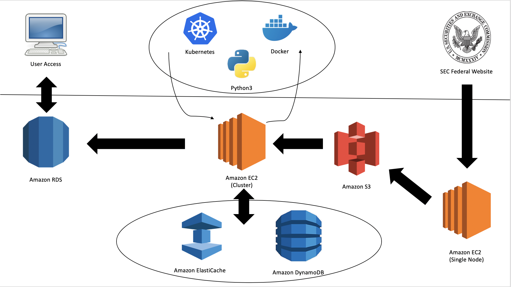

# Putnam Investments Coding Challenge by Samuel D. Judge

## Table of Contents
1. [Problem](README.md#problem)
1. [Basic Strategy](README.md#basic-strategy)
1. [Pipeline](README.md#pipeline)
1. [Pulling the Data](README.md#data)
1. [Assumptions](README.md#assumptions)
1. [Files in Repo](README.md#files-in-repo)
1. [Contact Information](README.md#contact-information)

## Problem

The problem, as stated, was to build a program that could be distributed that could read [SEC financial statements](https://www.sec.gov/dera/data/financial-statement-data-sets.html) and create a table that would calculate the following metrics for each filer for the period since 2010: 

* Quarter over Quarter Growth
* Year over Year Growth
* 3 Year Growth
* 5 Year Growth

The following was requested as part of the project: 

* a digram of the end-to-end data pipeline with all cloud services required (using AWS) 
* commented code (see the .py file) 
* output dataset saved in .csv format. 

## Basic Strategy

### Approach 1: 

Since the objective of this project is to scale this project to a distributed network, the initial idea was to attempt to use [Spark](https://en.wikipedia.org/wiki/Apache_Spark). Of course, within Spark, one can use [Spark SQL](https://www.edureka.co/blog/spark-sql-tutorial/) to essentially manipulate the data as a table. In general, the SQL logic to this problem is fairly straight forward: 

* Join the sub and num tables together on (sub.adsh = num.adsh). 
* Filter out only the tags you are interested in. 
* Filter out anything that has a COREG, as this means it is not a parent company. 
* For each tag, group by CIK and then by DDATE. 
* Keep only the most recent FILING for each DDATE. This can be done by keeping the one that has FILING = max(FILING) 
* Now that your data is down to only the most important rows, do the Cartesean product of this table with itself. 
* Keep only the data where the CIK1 = CIK2, (DDATE1 - DDATE2) is in the range of [85,95] days, [360, 370] days, [1080, 1110] days, and [1800, 1850] days, and where DDATE1 > DDATE2. 
* Now for each of these rows, compute ((VALUE1 - VALUE2) / VALUE2) * 100.

One issue is that it's a little unclear how well this process distributes, though the underlying [MapReduce](https://en.wikipedia.org/wiki/MapReduce) on Spark would probably do something clever. The code and process itself is not [embarrassingly parallelizable](https://en.wikipedia.org/wiki/Embarrassingly_parallel). 

The larger issue though is that this does not actually compute the correct percentage for all the tags. For most of the tags, the value associated is a _point in time_ number (that is, the value under the column qrts is 0). However, this calculation is completely bogus if comparing two values that represent changes over two separate timeframes (for example, 2 quarters and 3 quarters). One solution is the added step to SQL of forcing QRTS1 = QRTS2. But even this is not necessarily sufficient, because the calcuation being performed would not be one of a straight percentage growth, but rather the YOY percentage of a year growth. Given all of this and SQLs relative inflexibility to deal with such a potential issue, I decided to approach the problem in a slightly different way.  

### Approach 2:

For this approach, I decided to use mostly python to create a dictionary, which in my code is referred to as "companies_dict" (more on this later). This dictionary would contain all pertinent information needed for creating the final table. The general idea would be to use [Docker](https://en.wikipedia.org/wiki/Docker_(software)) to create several images of my Docker container, then use [Kubernetes](https://en.wikipedia.org/wiki/Kubernetes) to deploy this across a cluster. The logic behind the code was as follows: 

* Create a ADSH dictionary (or hash table) using the sub.txt file provided by the SEC. 
* Use this dictionary to connect each line in the num.txt file to the corresponding company in the sub.txt. 
* Using this now completed data for each line, filter out the lines that are not the parent company, as well as by tag. 
* Create the companies dictionary, which has the structure below. 
* Use this to check for every quarter, every year, and every company whether the four metrics can be computed.
* If so, do it and write to the file. Otherwise, skip. 

This dictionary specified above, for every unique company _CIK_, would have the following format for each __year__ and __quarter__ that company filed. 

dict(__CIK__) = {(company name, {__year__: {__quarter__: (value, ddate, filed)}})}

where _value_ is the number given by the SEC, _ddate_ is the date at which that value applies, and _filed_ is the date on which the value was filed. 

For example, if I wanted to find the data for General Electric (CIK: 40545) for Q3 in 2014, I would enter: 

dict('40545')(1)(2014)(2). 

This would return (value, ddate, filed) for the specified tag. 

As for how to distribute this, the idea was the replace the dictionary with either a [distributed cache](https://en.wikipedia.org/wiki/Distributed_cache) (see [Redis](https://redis.io/) and [Memcached](https://en.wikipedia.org/wiki/Memcached)) or using a [consistent distributed hashing](https://www.toptal.com/big-data/consistent-hashing). These would essentially take the role of the "dictionary" in my code and allow several different nodes to access and update it simultaneously. There were several issues that arose with this: 

* while it does allow more flexibility with the code, it essentially necessitates "recreating the wheel" in the sense that the "dictionary" is basically a hashed table. 

* I have never done this before and so my code is incomplete (as of September 20, 2019). It's possible, but I just was unable to complete it. 

* when programming Kubernetes, one needs to be clever in how they are going to distribute the data. Will it be in the form of individual files that Kubernetes will then pass on to the nodes? Or will it be splitting up a single file and sending those to the nodes? There are ways to specify this, but they can be tricky. 

* There's a question about consistency of the cached data. Redis will be very quick, but it's unclear of whether it will be able to handle the number of reads to a single piece of data that it might encounter on a distributed network. 

## Pipeline

As an explaination of the pipeline, here is a "play-by-play" of my idea of passage of the date. 

* the data is collected from the SEC website using a single EC2 instance. This is rather a luxary and this task could instead be delegated to the Master node in the cluster. But given the freedom and money, I like to separate tasks. 
* this EC2 instance then writes the files, under their new names, into an Amazon S3 bucket. 
* the cluster, which consists of several more EC2 instances, will then pull the data from the S3 bucket to process it. 
* the cluster will use Kubernetes, Docker, and a python3 file to process the data (see top bubble). 
* the program will use __either__ Amazon ElastiCache or Amazon DyanmoDB (a noSQL database), but not both. Since I struggled to be able to get either working, it's hard to see where one fails v. the other. Ultimately I would prefer to use ElastiCache (for speed's sake), but might be forced to use DynamoDB (a type of distributed hashing) to ensure consistency. (See the above [section](README.md#basic-strategy) for a more detail description of these objects role in the process). 
* Once the data is processed, it is sent to Amazon RDS. Here, it can be queried by the user based on what tag they are interested in. 

Here is a list of technologies used, as well as links to their description: 

* [Amazon EC2](https://aws.amazon.com/ec2/)
* [Amazon S3](https://aws.amazon.com/s3/)
* [Amazon DynamoDB](https://aws.amazon.com/dynamodb/)
* [Amazon ElastiCache](https://aws.amazon.com/elasticache/)
* [Amazon RDS](https://aws.amazon.com/rds/)
* [SEC Website](https://www.sec.gov/dera/data/financial-statement-data-sets.html)
* [Python](https://www.python.org/about/)
* [Docker](https://www.docker.com/)
* [Kubernetes](https://kubernetes.io/)

## Data

As a quick note, here is an example of how you can pull the data from the website without having to manually download it: 

* import urllib2 into python 
* use something like response = urllib2.urlopen('https://www.sec.gov/whateverextention')
* use html = response.read() to find the html. 
* search the html for "File" and then find the following <a href (telling you there's a hyperlink). 
* run this to find the address of the file. You'll find in the case of government websites, there's some consistent path pattern. For example: sec.gov/files/dera/data/financial-statement-data-sets/2019q2.zip
* import requests into your python folder. 
* r = requests.get('https://www.sec.gov/whereismydata')
* now the file is stored in memory. 
* you can cycle through all years (2010-2019) and all quarters (1-4) and repeat the process until you have pulled in all files. 

## Assumptions
* There is an assumption that the file names are in a particular form. This was implimented using [BeautifulSoup](https://www.crummy.com/software/BeautifulSoup/bs4/doc/) to pull the files from the website, some [bash](https://en.wikipedia.org/wiki/Bash_(Unix_shell)) code to extract and rename the files, and then [boto3](https://boto3.amazonaws.com/v1/documentation/api/latest/index.html?id=docs_gateway) to write it to an Amazon S3 bucket. The above psuedocode/description gives an alternative way of achieving the same goal.
* There is an assumption that the data is tab deliniated. This can be edited in the code, but should at least be noted. 
* There is an assumption that the data is small enough to fit into a dictionary. As long as you are limited to a single tag, this appears to be true. 

## Files in Repo 

### Putnam_Investments_CC.py

#### description: 
This is the main file. It can be run by itself as long as it is in the same directory as the files in question.    

### Putnam_Investments_CC.ipynb

#### description: 
This is the same as the above file, though less commented and meant for Jupyter Notebooks. Think of it as the "messing around" file. 

### assests_percentage_growth.csv

#### description: 
This is the requested "solution" .csv file that contains all the four metrics for every filing of every company since 2010 under the tag "Assets"  

### general_electric_growth.csv

#### description: 
This is the same as the above file, but only for General Electric Co. This is to allow for an easier viewing of the final solution.  

## Contact Information
* [Samuel David Judge](https://www.linkedin.com/in/samueldjudge/)
* Samuel.D.Judge@gmail.com
* 269.921.0330
